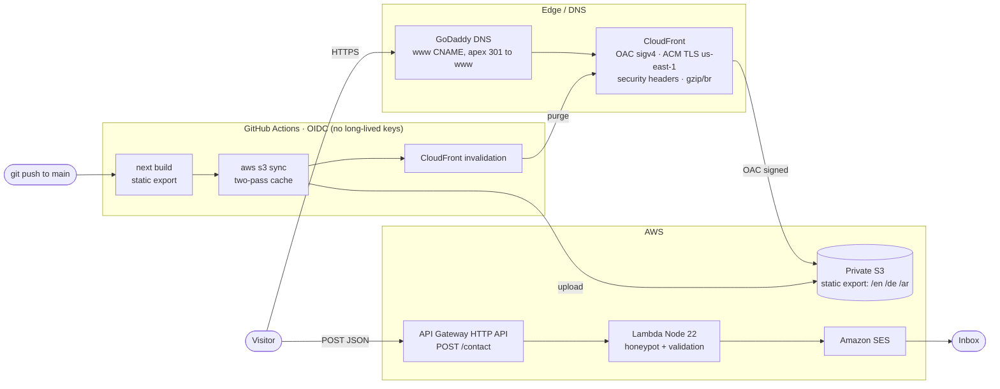

# Khaled Hossameldin — Portfolio

A premium personal portfolio that ships itself. A statically-exported Next.js site served from
AWS at the edge, with a single serverless path for the contact form — provisioned end-to-end with
Terraform and deployed by keyless OIDC CI/CD.

**Live:** <https://www.khaledhossameldin.com>

> The repository *is* part of the proof. The site talks about clean infrastructure and CI/CD; the
> `infra/` and `.github/` directories are that infrastructure — not a description of it.

---

## Highlights

- **Keyless deploys** — GitHub Actions assumes an AWS role via OIDC. No long-lived access keys
  exist anywhere; the trust policy is scoped to this repo's `main` branch only.
- **100% infrastructure as code** — every resource (S3, CloudFront, ACM, API Gateway, Lambda, SES,
  IAM/OIDC) is Terraform. Remote state in S3 with encryption and state locking.
- **Locked-down by default** — the origin bucket is private and reachable only through CloudFront
  Origin Access Control; the deploy role is least-privilege; HSTS and a security-headers policy
  ride on every response.
- **Static-export i18n, including Arabic RTL** — `en` / `de` / `ar` are generated at build time
  (`generateStaticParams`) with **no runtime middleware**; `ar` renders right-to-left with no
  layout flash.
- **Fast and accessible** — Lighthouse **100 / 100 / 100 / 100** on desktop and **99 / 96 / 100 /
  100** on mobile; all motion is gated behind `prefers-reduced-motion`.
- **Near-zero cost at rest** — no always-on compute, no database. Just object storage, a CDN, and
  a function that runs only when someone hits *Send*.

---

## Architecture



A fully static front end is served globally from CloudFront over a private S3 origin; TLS
terminates at the edge with an ACM certificate in `us-east-1`. The only dynamic path is the
contact form, which posts directly to an API Gateway HTTP API backed by a small Lambda that sends
mail through SES. There is no application server and no datastore.

---

## Tech stack

**Web** — Next.js 16 (App Router, `output: 'export'`) · React 19 · TypeScript 5 · Tailwind CSS 4 ·
next-intl 4 (en / de / ar) · Framer Motion · GSAP ScrollTrigger · Lenis · Radix UI.

**Infrastructure** — Terraform (≥ 1.10, AWS provider ~5.70) · S3 (private origin) · CloudFront
(OAC + CloudFront Functions) · ACM · API Gateway HTTP API · AWS Lambda (Node.js 22, ESM) ·
Amazon SES. Region `eu-central-1`, with a `us-east-1` alias for the CloudFront certificate.

**CI/CD** — GitHub Actions with OIDC federation to AWS · third-party actions pinned to commit
SHAs · two-pass S3 cache strategy · CloudFront invalidation · Slack deploy notifications.

---

## Repository structure

```
.
├── app/                 # Next.js site (static export → out/)
│   └── src/
│       ├── app/         # routes: [locale] segment, work/[slug]
│       ├── components/  # UI primitives + page sections
│       ├── lib/         # motion hooks, scroll helpers
│       ├── i18n/        # locale routing (en/de/ar)
│       └── messages/    # message catalogs per locale
├── infra/               # Terraform: S3, CloudFront, ACM, API GW, Lambda, SES, IAM/OIDC
├── lambda/contact/      # contact-form handler (Node 22, SES)
├── .github/workflows/   # deploy.yml — OIDC build → sync → invalidate
├── DESIGN_SYSTEM.md     # tokens + visual system
└── LICENSE              # MIT
```

---

## Infrastructure & CI/CD

Everything under `infra/` is Terraform, split by concern (`s3.tf`, `cloudfront.tf`, `acm.tf`,
`apigw.tf`, `contact_lambda.tf`, `iam_oidc.tf`). State lives in an encrypted S3 backend with
locking, so applies are safe to run from anywhere.

**Edge & origin.** The S3 bucket blocks all public access and grants `s3:GetObject` only to the
CloudFront distribution via an Origin Access Control (SigV4) bucket policy — the bucket is never
public. CloudFront attaches a response-headers policy (HSTS, `X-Frame-Options: DENY`,
`X-Content-Type-Options: nosniff`, `Referrer-Policy: strict-origin-when-cross-origin`), serves
compressed assets, enforces TLS 1.2+, and maps `403 → /404.html`.

**Deploy pipeline.** On every push to `main`, GitHub Actions requests an OIDC token
(`id-token: write`), assumes a least-privilege AWS role (S3 put/delete + CloudFront invalidate —
nothing else), builds the static export, and runs a **two-pass `aws s3 sync`**: hashed
`_next/static/*` assets get `Cache-Control: public, max-age=31536000, immutable`, while HTML and
other files get `max-age=0, must-revalidate`. A CloudFront invalidation follows, then a Slack
notification. Pipeline configuration is held in GitHub **Variables** (role ARN, bucket,
distribution id, contact API URL); the only **Secret** is the Slack webhook, which is never
echoed.

---

## Notable engineering decisions

- **Static-export i18n without middleware.** Static export can't run middleware, so locales are
  sub-path routes (`/en`, `/de`, `/ar`) generated via `generateStaticParams` with
  `dynamicParams = false`. Adding a locale is a message catalog plus a routing entry.
- **Directory-index at the edge.** A viewer-request CloudFront Function (`cloudfront-js-2.0`)
  rewrites directory and extensionless paths to `index.html`, so trailing-slash routes resolve
  cleanly against the static export without a server.
- **Two-phase ACM apply.** An `enable_custom_domain` flag lets the certificate be created first
  and validated out-of-band (DNS CNAME at GoDaddy); the `www` alias and cert attach to CloudFront
  only once the certificate is *issued* — no chicken-and-egg apply failure.
- **Hardened contact Lambda.** A hidden `hp_token` honeypot drops bots with a silent `200`; input
  is length-bounded and CR/LF-stripped to block header injection; CORS echoes the request origin
  **only** when it's on the allowlist (never `*`). The form falls back to direct email/social
  links if the API is ever unreachable, so contact never depends on the function being up.
- **Motion that respects the user.** Lenis, GSAP, and Framer Motion drive scroll and entrance
  animation, all short-circuited under `prefers-reduced-motion` to the final static state.
- **No CSP, on purpose.** The static export ships small inline scripts (theme, locale/`dir`
  pre-paint) that can't be nonce'd without a server, so a Content-Security-Policy is deliberately
  omitted rather than shipped permissively — a documented trade-off, not an oversight.

---

## Local development

```bash
cd app
npm install
npm run dev        # http://localhost:3000
npm run build      # static export → app/out/
```

**Deploys are automatic:** merge to `main` and GitHub Actions builds, syncs to S3, and invalidates
CloudFront. Infrastructure changes live in `infra/`:

```bash
cd infra
terraform init
terraform plan
terraform apply    # set enable_custom_domain=true only after the ACM cert is ISSUED
```

---

## About

Personal portfolio of Khaled Hossameldin — senior software engineer (Flutter/mobile, frontend,
backend, and the DevOps that runs them). Live at <https://www.khaledhossameldin.com>.
Released under the [MIT License](LICENSE).
